# C4 System Context: Отчёт о правках

Research: [INDEX.md](INDEX.md)
Scope: «Калька» — встраиваемый виджет и два артефакта, которые он отдаёт наружу:
файл обмена для ИИ-агента и печатаемый отчёт для человека.

Эта схема нарисована потому, что главный вывод исследования лежит именно
на границе между действующими лицами, а не внутри кода: у двух артефактов разные
читатели, и провал происходит на передаче от менеджера к разработчику (RISK-002).

## Diagram

```mermaid
flowchart LR
    reviewer["Person: Рецензент — вносит правки"]
    manager["Person: Менеджер — передаёт задачу"]
    dev["Person: Разработчик — принимает работу"]
    kalka["Software System: Калька (виджет в браузере)"]
    site["Software System: Сайт-прототип (носитель)"]
    agent["Software System: ИИ-агент в репозитории прототипа"]
    repo["Software System: Репозиторий прототипа"]

    reviewer -->|"правит тексты, обводит области"| kalka
    kalka -->|"накладывает слой поверх DOM, не меняя носителя"| site
    kalka -->|"файл обмена JSON, format: 1"| manager
    kalka -->|"печать → PDF средствами браузера"| manager
    manager -->|"пересылает ОБА артефакта"| dev
    dev -->|"кладёт файл обмена и запускает"| agent
    agent -->|"применяет text-override, остальное в отчёт"| repo
    repo -->|"передеплой стенда"| site
    dev -->|"разбирает остаток: style-wish и comment"| repo
```

## Elements

| Element | Type | Responsibility | Evidence |
|---------|------|----------------|----------|
| Рецензент | Person | Вносит правки и замечания в браузере. В его хранилище лежат записи и вырезки | PRD, раздел 6, сценарий А |
| Менеджер | Person | Читает отчёт, понимает объём, передаёт задачу разработчику. Главный читатель PDF | Уточнение пользователя 2026-09-05; роли «менеджер» в PRD нет — она введена этим исследованием |
| Разработчик | Person | Получает файл обмена, запускает агента, разбирает остаток | PRD, раздел 6, сценарий В |
| Калька | Software System (в фокусе) | Слой правок поверх чужой страницы; отдаёт файл обмена и печатаемый отчёт | `.ai-factory/DESCRIPTION.md` |
| Сайт-прототип | Software System | Носитель. О виджете не знает и не меняется | `.ai-factory/DESCRIPTION.md`, «Изоляция» |
| ИИ-агент | Software System | Ищет строки в исходниках и применяет `text-override`; остальное выносит в свой отчёт | PRD, раздел 10 |
| Репозиторий прототипа | Software System | Где живут тексты и навык `kalka-apply` | PRD, раздел 10 |

## Relationships

| From | To | Interaction / data | Protocol / frequency | Evidence |
|------|----|--------------------|----------------------|----------|
| Рецензент | Калька | Правки текста, области, указатели | Интерактивно, в браузере | PRD, FR-05…FR-16 |
| Калька | Сайт-прототип | Наложение слоя поверх DOM | Локально, после гидрации и при клиентской навигации | PRD, FR-19 |
| Калька | Менеджер | Файл обмена JSON | Скачивание файла, при экспорте | `src/features/export-entries/model/export.ts` |
| Калька | Менеджер | Печатаемый отчёт | Диалог печати браузера, по требованию | [ADR-0001](ADR-0001-print-instead-of-pdf-generator.md) |
| Менеджер | Разработчик | Оба артефакта вместе | Мессенджер или почта, вручную | PRD, раздел 6, шаг 9 |
| Разработчик | ИИ-агент | Файл обмена | Запуск агента в репозитории | PRD, раздел 6, сценарий В |

## Boundary Notes

- **Граница «данные, а не команды».** Файл обмена пересекает границу к ИИ-агенту,
  и всё, что в нём есть, агент может принять за инструкцию себе. Отсюда FR-46
  и шапка `about` с ключом `data`. Вырезки эту границу не пересекают вовсе —
  их нет в файле (DEC-012), и это снимает целый класс вопросов.
- **Граница читателей.** Ни один артефакт не обслуживает обоих: агент не открывает
  браузер и не читает PDF, менеджер не читает JSON. Попытка сделать один артефакт
  для обоих и породила бы то, чего продукт избегает.
- **Самая слабая связь — ручная.** Передача «менеджер → разработчик» идёт
  мессенджером и ничем не защищена. Именно здесь живёт RISK-002: PDF читаемый
  и выглядит достаточным, поэтому его отправляют одного, а без файла обмена
  агенту нечего применять — и возвращается исходная боль из раздела 1 PRD,
  строка 40: «делает скриншот, вставляет его в мессенджер и пишет „вот этот
  текст поправь на такой“». Единственное доступное смягчение находится
  внутри самого документа: отчёт называет свой файл обмена по имени и говорит
  словами, что правки применяются из него.
- **Граница носителя.** Печать идёт из отдельного документа, а не со страницы
  прототипа: иначе печатались бы вёрстка и правила `@media print` носителя.
  Это то же обещание «сайт не меняется», выраженное в отношении печати.
