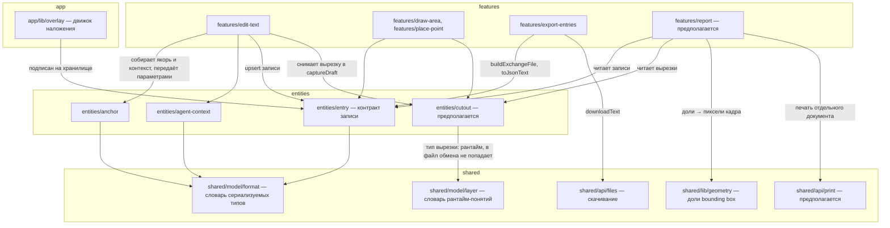

# Dependency Graph: Отчёт о правках

Research: [INDEX.md](INDEX.md)

Граф нарисован ради одного требования пользователя: «json формат должен быть
основным и от него мы точно не отказываемся». Требование выражается направлением
рёбер — дорожка отчёта зависит от контракта записи, и никогда наоборот. Пока
это направление держится, отчёт не может испортить выгрузку, чем бы он ни болел.

Существующие узлы взяты из кода; предполагаемые помечены явно и появятся только
после планирования.

## Graph

## Edges

| From | To | Type | Why required | Risk / change impact | Evidence |
|------|----|------|--------------|----------------------|----------|
| `features/edit-text` | `entities/anchor`, `entities/agent-context` | сборка на слое выше | Соседние слайсы одного слоя не импортируют друг друга, поэтому якорь и контекст собирает `features` и передаёт параметрами | Образец, которому обязана следовать вырезка | `src/features/edit-text/model/create.ts:1-2`; `src/entities/entry/model/draft.ts`, комментарии к `anchor` и `agent` |
| `features/edit-text` | `entities/cutout` (предполагается) | сборка на слое выше | Вырезка снимается там же, где `was`/`wasHtml` — на живом, ещё не правленном элементе | Съёмка в другом месте даст уже правленное состояние при повторной правке (FR-10) | `src/features/edit-text/model/create.ts:21` — «`was` и `wasHtml` захватываются ТОЛЬКО здесь» |
| `features/export-entries` | `entities/entry` | контракт | Собирает и сериализует файл обмена | Главная дорожка; менять нельзя | `src/features/export-entries/model/export.ts` |
| `features/report` (предполагается) | `entities/entry` | чтение | Отчёт строится из тех же записей | Только чтение: отчёт ничего не дописывает в запись | — |
| `features/report` | `entities/cutout` | чтение | Картинки мест правки | Отсутствие вырезки — штатный случай: отчёт показывает текст с явной пометкой (DEC-013) | [ADR-0004](ADR-0004-scratch-buffer-for-cutouts.md) |
| `features/report` | `shared/lib/geometry` | переиспользование | Метка на вырезке ставится по тем же долям, что на живой странице | Второй экземпляр этой арифметики разошёлся бы с первым | `src/shared/lib/geometry.ts`; `src/shared/model/format.ts`, `RectAnchor` |
| `features/report` | `shared/api/print` (предполагается) | внешняя граница | Печать — такое же обращение к браузеру, как скачивание файла | Новая граница рядом с `files.ts`, с тем же правилом про теневой корень | `src/shared/api/files.ts`, шапка файла |
| `entities/entry` | `shared/model/format` | общий словарь | Соседние слайсы `entities` не знают друг о друге; общие типы лежат слоем ниже | Контракт файла обмена | `.ai-factory/ARCHITECTURE.md`, «Взаимодействие слоёв и слайсов» |
| `entities/cutout` (предполагается) | `shared/model/layer` | общий словарь | Тот же запрет на соседей, но тип вырезки — рантайм-понятие: в файл обмена оно не попадает (DEC-012), а `format.ts` держит только сериализуемое | Положить тип вырезки в `format.ts` значило бы смешать контракт с рантаймом — ровно то, чего избегает существующий `layer.ts` | `src/shared/model/layer.ts:1-11`; `.ai-factory/ARCHITECTURE.md`, «Почему `layer.ts` отдельно от `format.ts`» |
| `app/lib/overlay` | `entities/entry` | подписка | Движок переприменяет слой сам, прямого вызова из `features` нет | Съёмка вырезки не имеет права дёргать движок | `.ai-factory/ARCHITECTURE.md`, «Взаимодействие слоёв и слайсов»; `src/features/edit-text/model/save.ts` |

## Findings

**Критический путь выгрузки:** `entities/entry` → `features/export-entries` →
`shared/api/files`. В нём нет ни одного узла дорожки отчёта, и это условие,
которое план обязан сохранить, а не совпадение. Файл обмена скачивается первым;
сбой отчёта не имеет права ни отменить выгрузку, ни пометить набор
неэкспортированным (DEC-010).

**Безопасная точка разделения:** `entities/entry` и `entities/cutout` — соседние
слайсы одного слоя, а значит по правилам проекта не импортируют друг друга.
Общий словарь обязан лежать слоем ниже, и для вырезки это `shared/model/layer.ts`,
а НЕ `format.ts`: в проекте уже проведена граница между контрактом файла обмена
и понятиями, живущими только в рантайме («В файл обмена они не попадают:
статус пересчитывается на каждой странице заново, а найденный `Element` вообще
не сериализуем», `src/shared/model/layer.ts:1-11`). Вырезка по DEC-012
в файл обмена не попадает и потому принадлежит второму словарю.

Насколько это гарантия: правило слоёв не даёт `entities/entry` и `entities/cutout`
увидеть друг друга, а размещение типа в `layer.ts` уводит его из словаря, который
сериализуется. Это делает попадание вырезки в файл обмена заметным при разборе,
а не невозможным: `toExchangeEntry` собирает запись поимённо
(`src/entities/entry/model/serialize.ts`), и последний рубеж — именно он, а не
структура папок. Вывод: расположение снижает вероятность ошибки, но окончательный
запрет держится тем же поимённым сбором, что и раньше (FR-46).

**Циклов нет.** Все рёбра направлены сверху вниз по `app → features → entities → shared`.
Единственное место, где рука тянется провести ребро вбок, — съёмка вырезки
из `entities/entry`: там уже лежит `captureDraft`-подобная логика. Делать этого
нельзя по тому же правилу, по которому туда не попали `captureAnchor`
и `captureAgentContext`, и оба соответствующих комментария в
`src/entities/entry/model/draft.ts` предупреждают следующего читателя прямым текстом.

**Три точки съёмки, один слой (DEC-015).** Записи типа `comment` создаются
из `features/draw-area` и `features/place-point`, правки текста —
из `features/edit-text`. Точек съёмки вырезки получается три, и все три лежат
на слое `features` — единственном, которому видны оба нужных `entities`.
Туда же и уходит общая сборка: это не новый приём, а тот же, которым уже
собираются `anchor` и контекст для агента, и обоснован он теми же комментариями
в `src/entities/entry/model/draft.ts`. Что именно вынести в общий вызов, а что
оставить в каждой точке, — работа плана, а не исследования.
